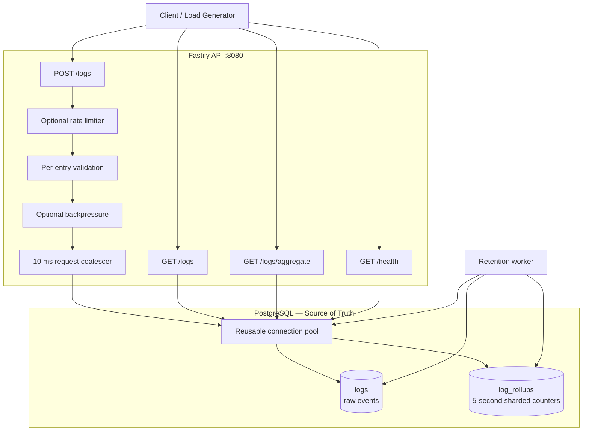
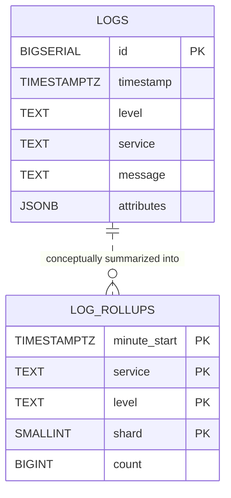
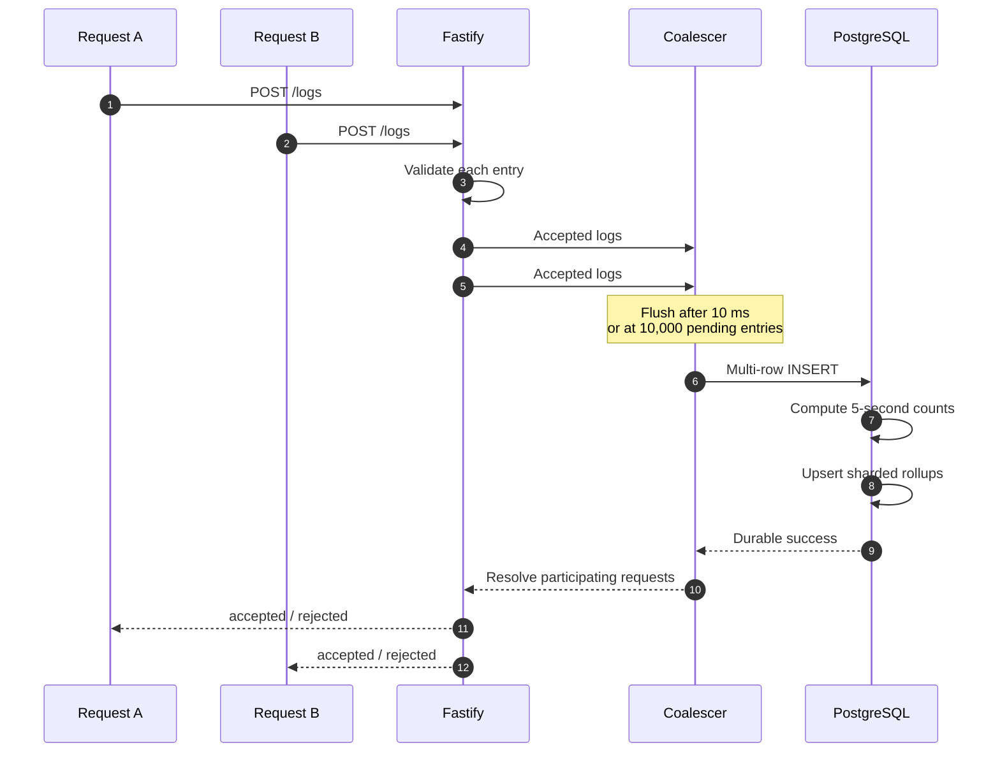
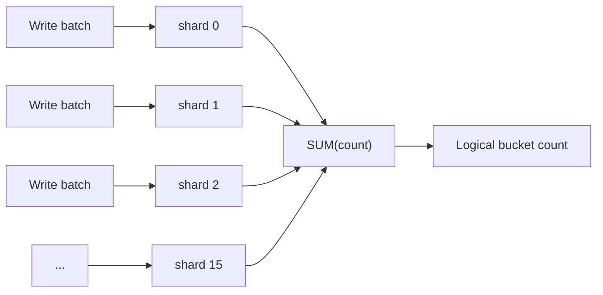
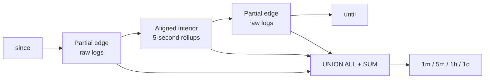
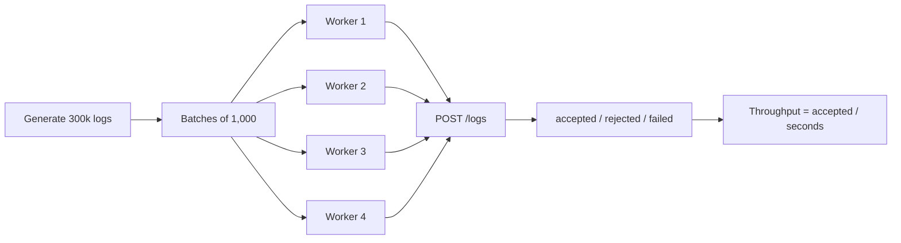
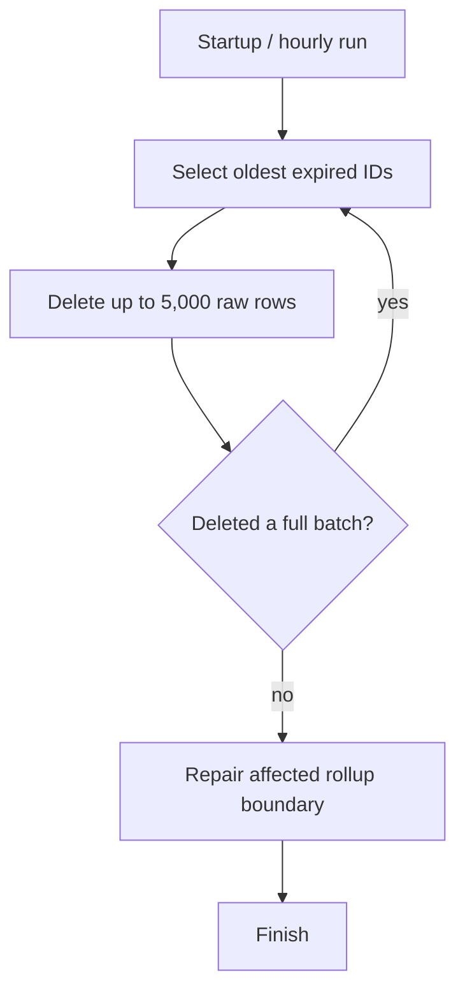
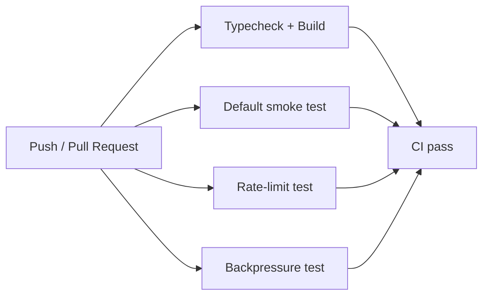

<div align="center">

# Fastify Log API

### High-performance structured log ingestion, querying, and aggregation under strict resource limits

**Best Local Benchmark: 94.9 / 100**  
**Linux Verification: 94.5 / 100**

**14,999 logs/s · 0.0% errors · 15/15 correctness · 20/20 reliability**

[](https://github.com/maiaburaad/fastify-log-api/actions/workflows/ci.yml)


</div>

---

## Why This Project Is Interesting

This is not only an API implementation. It is a performance-engineering exercise built around a strict contract and strict infrastructure limits.

The service had to:

- ingest large batches of structured logs;
- keep PostgreSQL as the source of truth;
- support deterministic cursor pagination;
- filter by service, level, time range, message text, and arbitrary JSONB attributes;
- answer grouped time-bucketed aggregations;
- remain correct under load;
- stay within **0.5 CPU / 256 MB** for the application and **1 CPU / 1 GB** for PostgreSQL;
- and survive load, stress, spike, and breakpoint scenarios.

The final design came from repeated measurement:

> **implement → benchmark → identify the bottleneck → isolate an experiment → benchmark again → keep or revert**

That process included successful optimizations, regressions, discarded ideas, custom testing scripts, and multiple benchmark environments.

---

## Performance at a Glance

| Metric | Best Local Run | Ubuntu 26.04 LTS / WSL2 |
|---|---:|---:|
| **Total score** | **94.9 / 100** | **94.5 / 100** |
| Correctness | **15 / 15** | **15 / 15** |
| Load throughput | **14,999 logs/s** | **14,999 logs/s** |
| Error rate | **0.0%** | **0.0%** |
| Request p95 | **~27–28 ms** | **~54 ms** |
| Aggregate p95 | **~4 ms** | **~28 ms** |
| Reliability | **20 / 20** | **20 / 20** |

The final implementation reached a best local benchmark score of **94.9 / 100**.

The complete stack was also independently reproduced on **Ubuntu 26.04 LTS / WSL2**, scoring **94.5 / 100** with **14,999 logs/s** and **0.0% errors**.

<p align="center">
  
</p>

### Development Milestones

Git history preserves earlier benchmark snapshots that show how substantially the implementation evolved during optimization.

| Milestone | Score | Machine speed | Throughput | Request p95 | Aggregate p95 | Errors |
|---|---:|---:|---:|---:|---:|---:|
| Early optimization snapshot | **64.2** | **0.200x** | **6,158/s** | **2,769 ms** | **1,569 ms** | **0%** |
| Optimized rollup snapshot | **94.6** | **0.476x** | **14,999/s** | **51 ms** | **23 ms** | **0%** |
| Best local run | **94.9** | ~**0.48x** | **14,999/s** | **~27–28 ms** | **~4 ms** | **0%** |

<p align="center">
  
</p>

These runs were recorded under different machine-speed conditions, so they are presented as **engineering milestones**, not as a controlled single-variable A/B experiment.

---

## Resource Envelope

| Component | Limit |
|---|---:|
| Fastify application | **0.5 CPU / 256 MB RAM** |
| PostgreSQL | **1 CPU / 1 GB RAM** |
| Benchmark generator | **4 CPUs / 1 GB RAM** |
| Seed dataset | **1,000,000 rows** |

The benchmark also reported generator limitations in stress, spike, and breakpoint on some runs. Those scenarios therefore understate the offered workload and should not be read as exact service saturation points.

---

# Architecture



The raw `logs` table remains authoritative. `log_rollups` is a derived acceleration structure used to make common aggregation queries cheap.

Query parsing and validation are separated from the HTTP route layer, keeping `routes/logs.ts` focused on request orchestration and response handling.

---

# Data Model



The relationship shown above is **conceptual**. There is no foreign-key relationship between individual raw logs and rollup rows.

`minute_start` is a historical column name. In the final design it represents the beginning of a **5-second rollup interval**.

## Why JSONB?

Log attributes are producer-defined and schema-flexible. One service may send `region`, another `worker`, another `request_id`. JSONB allows those keys to coexist without a database migration for each new attribute.

Example:

```json
{
  "region": "local",
  "worker": 2,
  "benchmark": true
}
```

`attr.<key>` filters compile to PostgreSQL JSONB extraction using `attributes ->> key`.

---

# Indexing Strategy

The final schema uses targeted indexes around the access patterns exercised by the API.

| Index | Type | Supports |
|---|---|---|
| `(timestamp DESC, id DESC)` | B-tree | ordering, cursor pagination, time-based reads |
| `(service, timestamp DESC, id DESC)` | B-tree | service-filtered chronological queries |
| `(level, timestamp DESC, id DESC)` | B-tree | level-filtered chronological queries |
| `timestamp` | BRIN | lightweight support for large time-oriented scans |

There is **no GIN index** in the final schema.

A lightweight **BRIN index** is also maintained on `timestamp`. Because log data is naturally inserted in roughly chronological order, BRIN provides a compact secondary access path for large time-oriented scans without requiring another large B-tree.

The key principle was not “add indexes everywhere,” but:

> **index the access patterns the API actually uses, then measure the result.**

---

# Write Path



## Request Coalescing

Concurrent requests are briefly collected before database work is issued.

```text
COALESCE_WINDOW_MS = 10
MAX_BATCH_ENTRIES = 10,000
```

This converts many small concurrent write operations into fewer, larger database operations.

## Multi-row INSERT

The final write path uses a parameterized multi-row `INSERT`, not `COPY`.

That choice was made from measurement, not assumption.

---

# The COPY Experiment

PostgreSQL `COPY` was explicitly tested because it is often one of the first recommendations for high-volume ingestion.

It did **not** win for this workload.

Selected local measurements during the experiment:

| Ingestion path | Approx. measured throughput | Decision |
|---|---:|---|
| Multi-row INSERT baseline | ~10.4k logs/s | Continue tuning |
| Multi-row INSERT, larger batch | ~10.5k logs/s | Small gain |
| COPY CSV | ~5.2k logs/s | Rejected |
| COPY CSV with logging disabled | ~5.3k logs/s | Still rejected |
| Multi-row INSERT with logging disabled | ~18.2k logs/s | Strong local result |
| COPY TEXT + transactional rollup work | ~6.2k logs/s | Rejected |
| Multi-row INSERT + rollup work | ~13.1k logs/s | Better fit |

`COPY` is an excellent bulk-loading primitive in many workloads, but this API is not a one-shot file importer.

The write path also includes:

- validation;
- HTTP batching;
- rollup maintenance;
- transactional semantics;
- concurrent requests;
- and durability requirements.

The experiment was therefore reverted instead of being kept merely because `COPY` is theoretically associated with bulk performance.

> **A famous optimization is still only a hypothesis until it survives your workload.**

---

# 16-Way Rollup Sharding

Without sharding, concurrent writers can repeatedly update the same logical rollup counter.

The final design adds a `shard` to the rollup primary key:

```text
(minute_start, service, level, shard)
```

Each ingestion flush chooses a shard in round-robin order:

```text
0 → 1 → 2 → ... → 15 → 0
```



The write side spreads contention; the read side reconstructs the logical count with `SUM(count)`.

---

# Aggregation Strategy

The final aggregation design combines **5-second rollups** with direct raw-log reads for partial edges.



Why not use rollups for every byte of the range?

Because `since` and `until` may fall in the middle of a 5-second interval. Taking the entire counter would over-count.

The final design therefore uses raw rows only where exact boundaries require them.

When the query contains filters not represented in the rollup, such as:

```text
q
attr.<key>
```

aggregation falls back to the raw `logs` table.

---

# Performance Engineering Journey

The repository history records the architecture evolving in stages.


## Selected Git Milestones

| Commit | Change |
|---|---|
| `311f331` | PostgreSQL setup and migrations |
| `5470c89` | Batch log ingestion |
| `7d54ceb` | Rollup aggregation and performance work |
| `f30eab4` | Aggregation optimization with rollups |
| `b576eda` | Log ingestion and rollup-update optimization |
| `fcda313` | Add BRIN timestamp index |
| `ba67edc` | Shard rollup counters |
| `b963ee4` | Increase / tune database pool size |
| `9be9061` | Optimize aggregate partial-edge handling |
| `7f903b5` | Rebuild rollups at 5-second granularity |
| `62da35e` | Coalesce concurrent ingestion requests |
| `2aa5fc8` | Keep rollups consistent during retention |
| `91efbbf` | Optional rate limiting and backpressure |
| `c666206` | CI build and smoke tests |
| `76e2fc0` | Migration cleanup / obsolete code removal |

---

# Experiments and Alternatives

Not every idea tested during development became the central architecture.

The repository history contains isolated experiment and backup branches including:

```text
experiment-async-rollup
experiment-rollup-deltas
experiment-rollup-deltas-v2
experiment-post-94
experiment-rate-backpressure
backup-brin-version
backup-current-optimized
backup-old-version
```

These branches made it possible to explore alternatives without destabilizing the main implementation.

## Async Rollup Experiment

An asynchronous rollup direction was explored, but the final architecture keeps raw insertion and rollup maintenance together in the ingestion database path.

The final choice favors straightforward consistency semantics: a successful write does not leave derived counters intentionally pending in a separate asynchronous pipeline.

## Rollup-Delta Experiments

Alternative rollup-update strategies were tested before the project converged on:

```text
5-second counters
+
16-way sharding
+
partial-edge raw reads
```

The experiment branches were retained rather than pretending every attempted optimization became part of the final system.

## Pool Tuning

The database pool was tuned during performance work.

More connections were not treated as automatically better.

The final Docker configuration uses:

```text
DB_POOL_MAX=20
```

while the code fallback is `10`.

## BRIN Evaluation

A BRIN index on `timestamp` was explicitly evaluated during performance tuning.

Unlike several discarded experiments, the BRIN index remained in the final schema as a lightweight complement to the primary B-tree indexes.

Its role is deliberately limited: the B-tree indexes remain responsible for deterministic ordering, cursor pagination, and selective service/level queries, while BRIN provides a compact secondary index for large time-oriented scans.

This reinforced the project's general optimization rule:

> **test it, measure it, and keep it only when it earns its place in the final design.**

---

# Custom Benchmarking During Development

The project did not rely only on the final evaluator.

Custom scripts were written to test ingestion behavior quickly while changing batch size, concurrency, and implementation strategy.

## `scripts/bench-ingest.ts`

One version of the custom ingestion benchmark generated:

```text
TOTAL_LOGS = 300,000
BATCH_SIZE = 1,000
CONCURRENCY = 4
```

Each worker repeatedly sent:

```http
POST /logs
```

and tracked:

```text
accepted
rejected
failed requests
elapsed time
logs / second
```

Conceptually:



## Why Custom Scripts Mattered

The custom benchmarks were useful for fast development feedback:

- compare ingestion strategies;
- change batch size;
- vary concurrency;
- catch failed requests;
- measure local logs/sec;
- verify whether an optimization was worth sending to the full benchmark.

They were **development tools**, not substitutes for the official workload.

The full benchmark was still used for correctness, load/stress/spike/breakpoint behavior, aggregation latency, and reliability.

---

# When the Score Dropped

A lower local score did not always mean a code regression.

Selected runs:

| Run | Machine speed | Score | Throughput | Request p95 | Aggregate p95 |
|---|---:|---:|---:|---:|---:|
| Best local run | ~0.48x | **94.9** | **14,999/s** | **~27–28 ms** | **~4 ms** |
| Slower-machine run | 0.38x | **89.0** | **14,999/s** | **415 ms** | **138 ms** |
| Optional-feature verification | 0.34x | **90.6** | **14,870/s** | **282 ms** | **125 ms** |
| Ubuntu reproduction | 0.41x | **94.5** | **14,999/s** | **54 ms** | **28 ms** |

The benchmark tool itself warned when the generator could not schedule every requested iteration.

This changed how performance results were interpreted:

> **score + machine speed + generator behavior + correctness + errors**  
> **is more meaningful than score alone.**

---

# API Reference

## POST `/logs`

Batch ingestion with per-entry validation.

```json
{
  "logs": [
    {
      "timestamp": "2026-08-23T10:00:00.000Z",
      "level": "info",
      "service": "checkout",
      "message": "payment accepted",
      "attributes": {
        "region": "local",
        "attempt": 1,
        "success": true
      }
    }
  ]
}
```

### Validation

| Field | Rule |
|---|---|
| `timestamp` | ISO-8601; no more than 5 minutes in the future |
| `level` | `debug`, `info`, `warn`, `error` |
| `service` | non-empty string |
| `message` | non-empty string |
| `attributes` | optional flat object of string, number, or boolean |

Valid entries may still be accepted when other entries in the same batch are rejected.

---

## GET `/logs`

Supported query parameters:

| Parameter | Purpose |
|---|---|
| `service` | exact service filter |
| `level` | exact level filter |
| `since` | inclusive lower timestamp bound |
| `until` | exclusive upper timestamp bound |
| `q` | case-insensitive substring search on `message` |
| `attr.<key>` | JSONB attribute filter |
| `limit` | default `100`, maximum `1000` |
| `cursor` | opaque cursor from the previous page |

Results are ordered with:

```sql
ORDER BY timestamp DESC, id DESC
```

Cursor comparisons use the same pair, producing deterministic pagination without deep `OFFSET` scans.

Query parsing and validation for this endpoint are handled separately in `src/validation/log-query.ts`, keeping the HTTP route focused on orchestration.

---

## GET `/logs/aggregate`

Required:

```text
since
until
bucket = 1m | 5m | 1h | 1d
```

Optional:

```text
service
level
q
attr.<key>
group_by = service | level
```

Buckets are returned in ascending time order.

Aggregation query parsing and validation are handled in `src/validation/aggregate-query.ts`.

---

## GET `/health`

The service checks PostgreSQL with:

```sql
SELECT 1
```

Startup performs:

```text
DB connectivity
    ↓
migrations
    ↓
retention scheduler
    ↓
route registration
    ↓
listen on 0.0.0.0:8080
```

A reachable `200 {"status":"ok"}` therefore indicates the application has completed startup and can still reach the database.

---

# Retention

Default policy:

```text
RETENTION_DAYS = 30
RETENTION_BATCH_SIZE = 5,000
RETENTION_INTERVAL = 1 hour
```

The job runs immediately on startup and then hourly.



The cleanup logic also keeps the derived rollups consistent with surviving raw data.

---

# Optional Rate Limiting and Backpressure

Both are **off by default** so they do not interfere with the standard benchmark workload.

## Rate Limiting

Enable:

```text
RATE_LIMIT_REQUESTS_PER_SECOND=<positive integer>
```

When the one-second request window is exhausted:

```text
429 Too Many Requests
Retry-After: 1
```

## Backpressure

Enable:

```text
MAX_IN_FLIGHT_LOGS=<positive integer>
```

If accepting another batch would exceed the configured in-flight limit:

```text
503 Service Unavailable
Retry-After: 1
```

Backpressure was tested directly and in CI.

The service never responds `200` to a batch rejected by the backpressure gate.

---

# Migrations

Final migration set:

```text
001_create_logs_table.sql
002_add_log_indexes.sql
003_create_log_rollups.sql
004_add_timestamp_brin.sql
005_shard_log_rollups.sql
006_rebuild_rollups_5s.sql
```

Migrations are:

- discovered from `src/db/migrations`;
- sorted by filename;
- recorded in a `migrations` table;
- executed transactionally;
- skipped when the same filename is already recorded.

The complete fresh-start path was also verified on Ubuntu from a new PostgreSQL volume.

---

# Continuous Integration

GitHub Actions automatically tests pushes and pull requests targeting `main`.



| CI job | Verification |
|---|---|
| Typecheck and Build | dependency install, `tsc --noEmit`, build |
| Default Mode Smoke Test | Docker startup, `/health`, POST, GET, aggregate |
| Rate Limiting Smoke Test | enabled mode produces `429` |
| Backpressure Smoke Test | enabled mode produces `503` + `Retry-After` |

---

# Quick Start

## Requirements

- Docker
- Docker Compose

```bash
git clone https://github.com/maiaburaad/fastify-log-api.git
cd fastify-log-api
docker compose up --build
```

Check readiness:

```bash
curl http://localhost:8080/health
```

Expected:

```json
{"status":"ok"}
```

Stop and remove the local database volume:

```bash
docker compose down -v
```

---

# Configuration

| Variable | Default / Compose value | Purpose |
|---|---|---|
| `DB_HOST` | `postgres` in Compose | PostgreSQL host |
| `DB_PORT` | `5432` | PostgreSQL port |
| `DB_USER` | `postgres` | PostgreSQL user |
| `DB_PASSWORD` | `postgres` | PostgreSQL password |
| `DB_NAME` | `logs_db` | database name |
| `DB_POOL_MAX` | `20` in Compose / `10` fallback | max pool connections |
| `RETENTION_DAYS` | `30` | retention window |
| `RATE_LIMIT_REQUESTS_PER_SECOND` | unset | optional request limit |
| `MAX_IN_FLIGHT_LOGS` | unset | optional overload threshold |

Internal constants:

```text
COALESCE_WINDOW_MS = 10
MAX_BATCH_ENTRIES = 10,000
ROLLUP_SHARDS = 16
ROLLUP_INTERVAL = 5 seconds
RETENTION_BATCH_SIZE = 5,000
RETENTION_INTERVAL = 1 hour
```

---

# Benchmark Reproduction

Official CLI used during final local measurements:

```bash
npx --yes github:Ahmad-Abbas-Foothill/logs-benchmark-cli \
  --compose ./docker-compose.yml \
  --full \
  --seed 6122026 \
  --runner docker \
  --json benchmark-report.json \
  --generator-cpus 4
```

## Best Local Result

```text
Total          94.9 / 100

Correctness    15 / 15
Throughput     14,999 logs/s
Errors         0.0%
Request p95    ~27–28 ms
Aggregate p95  ~4 ms
Reliability    20 / 20
```

## Ubuntu 26.04 LTS / WSL2 Verification

```text
Correctness    15.0 / 15
Performance    45.0 / 50
Queries        14.5 / 15
Reliability    20.0 / 20

Total          94.5 / 100

Throughput     14,999 logs/s
Errors         0.0%
Request p95    ~54 ms
Aggregate p95  ~28 ms
Machine speed  0.41x reference
```

The Ubuntu run used the same application resource limits and started from a fresh PostgreSQL volume.

---

# Project Structure

```text
fastify-log-api/
├── .github/
│   └── workflows/
│       └── ci.yml
├── docs/
│   ├── latency-comparison.png
│   └── performance-evolution.png
├── scripts/
│   ├── bench-concurrent.ts
│   └── bench-ingest.ts
├── tests/
│   └── fixtures/
│       ├── empty-batch.json
│       ├── invalid-level.json
│       └── test-log.json
├── src/
│   ├── db/
│   │   ├── migrations/
│   │   │   ├── 001_create_logs_table.sql
│   │   │   ├── 002_add_log_indexes.sql
│   │   │   ├── 003_create_log_rollups.sql
│   │   │   ├── 004_add_timestamp_brin.sql
│   │   │   ├── 005_shard_log_rollups.sql
│   │   │   └── 006_rebuild_rollups_5s.sql
│   │   ├── aggregate-logs.ts
│   │   ├── ingest-coalescer.ts
│   │   ├── insert-logs.ts
│   │   ├── migrate.ts
│   │   ├── pool.ts
│   │   ├── query-logs.ts
│   │   ├── retention.ts
│   │   └── test-connection.ts
│   ├── routes/
│   │   └── logs.ts
│   ├── schemas/
│   │   └── log.ts
│   ├── validation/
│   │   ├── aggregate-query.ts
│   │   └── log-query.ts
│   ├── utils/
│   │   └── cursor.ts
│   ├── rate-limit.ts
│   ├── retention-runner.ts
│   └── server.ts
├── Dockerfile
├── docker-compose.yml
├── benchmark-report.json
├── benchmark-report-linux.json
├── package.json
└── tsconfig.json
```

The route layer now focuses on HTTP concerns, while query parsing and validation live under `src/validation/`. Test payloads used during manual verification are kept separately under `tests/fixtures/`.

---

# Engineering Takeaways

### Measure First

A theoretically faster approach can still be slower in the real request path.

The `COPY` experiment was the clearest example.

### Optimize Database Work

The major improvements targeted database round trips, hot-row contention, aggregation work, and bounded maintenance rather than micro-optimizing TypeScript.

### Preserve Semantics

Correctness remained **15/15** while the architecture changed.

Pagination stability, aggregate correctness, durable acknowledgement, and retention consistency were not traded away for speed.

### Separate Responsibilities

The final refactor moved GET query parsing and validation out of the HTTP route layer.

`routes/logs.ts` now concentrates on request orchestration and response handling, while `validation/log-query.ts` and `validation/aggregate-query.ts` own query validation concerns.

This keeps the route layer easier to read and maintain without changing the API contract.

### Keep Failed Experiments

Separate branches made it possible to test async rollups, rollup deltas, `COPY`, pool changes, and post-94 experiments without endangering the stable implementation.

### Interpret Benchmarks With Context

Machine speed and generator limitations materially changed local scores.

A benchmark number without its environment is incomplete.

### Reproduce the Result

The final stack was started from a fresh database and benchmarked again on Ubuntu/WSL2, producing **94.5 / 100**, **14,999 logs/s**, **0.0% errors**, and full correctness.

---

<div align="center">

## Built by measurement, not assumption.

**Fastify · TypeScript · PostgreSQL · Docker · GitHub Actions**

</div>
